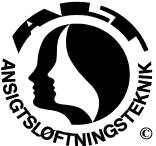

### A.L.T.© Andlitsmassaga.

(ANSIGTSLØFTNINGSTEKNIK)

A.L.T. © er en let bindevævsmassage, som bliver givet
på huden og det underliggende bindevæv. Huden bliver mere elastisk og får en sundere udstråling. Processen virker i dybden og omfatter alle 97 muskler i ansigtet, hårbunden, halsen, nakken og den øverste del af skulderen.

Hvis man ser nøje efter, har alle mennesker et asymmetrisk ansigt. Men hvor tydelig er denne asymmetri? Alle mennesker spænder nogle muskler mere i den ene side og andre muskler i den anden side. Jo flere spændinger, der er i ansigtsmusklerne, jo mere asymmetrisk er ansigtet. Ved at formindske spændingsnivauet i alle ansigtsmusklerne vil begge siderne af ansigtet blive mere ens.

A.L.T. © kan hjælpe for spændinger i ansigts- og/eller nakkemusklerne, forskellige former for hovedpine og forbedre bidfunktionen.

A.L.T. © behandlingen giver velvære i hele kroppen. Ansigtet er sjælens spejl. Kroppen, tanker og følelser hænger sammen.

Når psykologer prøver at finde ud af hvad de fleste mennesker betragter som et smukt ansigt, fremhæves der ofte 3 kvaliteter: et ansigt er afslappet, symmetrisk og levende – d.v.s. ansigtet giver respons, når vi kommunikerer med personen.

En kombination af de forskellige behandlinger har givet gode resultater ved problemer som mellemørebetændelse, bækkenløsning og piskesmæld (whiplash).
