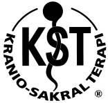
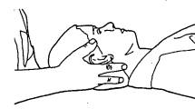

Formålet med Kranio-Sakral Terapi er at forbedre funktionen af det Kranio-sakrale system, som fysisk støtter hjernen og rygmarvens nerver og holder dem på plads. Kranio-sakrale systemet er knoglerne i kraniet, ansigtet og korsbenet (sacrum), membranerne som holder hjernen på plads i forhold til disse knogler og cerebrospinalvæsken, som cirkulerer omkring hjernen. Denne væske virker som stødpude overfor fysiske påvirkninger, og visse stoffer kan endvidere udveksles med hjernen via cerebrospinalvæsken.

### Hvordan foregår behandlingen?

I rolige og afslappende omgivelser ligger klienten på briksen og nyder behandlingen. Kranio-sakral terapeuten anvender et meget let tryk på omkring 5 gram (et brev vejer 20 gram) på specielle steder på hovedet, nakken, ryggen og korsben. Klienten føler en behagelig dyb afspænding – næsten søvntilstand og drømmer, flyder, er bevidst om omgivelserne og slapper af.

Problemer i det Kranio-sakrale system kan stamme fra fødslen, en ulykke eller et slag i hovedet, ryggen, korsben eller haleben. K.S.T. behandlingen frigør eventuelle spændinger i leddene mellem knoglerne, får afspænding i de stærke membraner, som holder hjernen på plads og forbedrer cirkulationen af både cerebrospinal-væsken og blodet.

Kranio-Sakral Terapi blev opfundet af en amerikansk læge, William Southerland, tidligt i det tyvende århundrede. Det blev hurtigt en del af lægeuddannelsen i de osteopatiske skoler, men som årene gik, blev disse teknikker mindre brugt, da det ikke økonomisk kunne betale sig for en læge at afsætte en hel time til en K.S.T. behandling. Lægerne anvendte mere og mere recepter og operationer. For ca. 20 år siden blev Kranio-Sakral Terapien igen kendt gennem en anden amerikansk læge Dr. John Upledger. Han har ved sin videnskabelige forskning i Kranio-Sakral Terapi ved mikro-anatomiske undersøgelser med elektron mikroskoper og kliniske undersøgelser udviklet teknikker til behandling i K.S.T., og begyndte på sit institut at undervise også ikke læge uddannede behandlere. Udbredelsen af K.S.T.-behandlingen er gået stærkt, og i dag kan man få denne form for kropsterapi overalt i U.S.A. og de fleste steder i Europa.

### Hvad kan Kranio-Sakral Terapien hjælpe for?
- K.S.T. kan hjælpe på migræne og hovedpine. En årsag til hovedpine kan være forstyrrelser af cirkulationen af blod til eller fra hjernen. En anden årsag kan være spændinger i bindevævet i hovedet (meninges), som skiller højre og venstre hjernedele fra hinanden.
- K.S.T. kan forbedre koncentrationen, hukommelsen, indlæringsproblemer, ordblindhed og stress.
- K.S.T. kan hjælpe til at få balance i hormonsystemet.
- K.S.T. kan hjælpe på øresusen (tinnitus), nedsat hørelse, skelen, nedsat lugte- og smagssans.
- K.S.T. kan forbedre bidfunktionen og regulere tændernes placering i munden.
- K.S.T. hjælper til at løsne muskelspændinger og sætte knoglerne på plads.
- K.S.T. kan hjælpe kolikbørn og har god virkning på ADHD, spasticitet og hjerneskade bl.a. lammelser (paresis).
