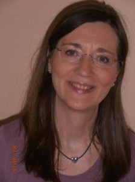

### Uddannelse:
- Kontorassistent, Politikontoret i Tórshavn, 1970.
- Sygeplejerske, Sygeplejeskolen i Tórshavn, 1989.
- Kraniosakral terapeut (KST) i 1992.
- Rolfs Metode© í kropsterapi i 1995.
- ALT© ansigtsmassage i 1995.
- Godkendt underviser i kraniosakral terapi í 1997.
- Psykolog, cand. psych. frá Københavns Universitet i 2010.
- Tankefelt terapeut (TFT) i 2010.
- Grunduddannelse i klinisk hypnoterapi i 2011.
- Autorisation fra Dansk Psykolognævn i 2012.

### Arbejdserfaring:

Har arbejdet på kontor fra 1970 og i Hjemmeplejen i Miðvág og Sandavág frá 1982. Arbejdet som sygeplejerske på Landssygehuset i Tórshavn, Plejehjemmet på Vågø og som hjemmesygeplejerske på Vågø fra 1989-95. Undervist i Kraniosakral terapi og kropsterapi fra 1997 og undervist i psykologi på Føroya Studentaskúla 2002-03. Har haft egen klinik siden 1992 og arbejder som privat praktiserende psykolog i Tórshavn og Miðvág fra 2010.

### Nuværende arbejdsområde:

Psykologisk behandling af børn, unge og voksne, par og familier. Sorgsamtaler i forbindelse med sygdom og dødsfald og også vejledning og rådgivning om reaktioner i forbindelse med sorg hos børn og unge. Stressforebyggende- og stressbehandling og behandling for depression, angst og fobier.
Vejledning, undervisning og supervision af personale i sundheds-, social- og skolesektoren.
Har mulighed for at tage psykologiske tester af børn og voksne f.eks. WAIS-IV, WISC-IV, Rorschach, TAT, BDI m.v. for bedre at kunne tilrættelægge en indsats.
Arbejder ifølge aftale mellem Heilsutrygd (den færøske sygesikring) og fagforeningen af færøske psykologer om økonomisk tilskud til psykologbehandling.
Behandling for smerte, som f.eks. kan stamme fra spændinger i muskler og led samt for skævheder i ryg, nakke, hoved ect

Behandling for ordblindhed.

### Behandlingstilgang 

I de psykologiske behandlinger arbejder jeg udfra forskellige psykologiske retninger, som tilpasses til den enkelte. Som regel arhejder jeg udfra en eklektisk tankegang, der indeholder forskellige psykoligiske terorier f.eks. psykodynamisk teori, kongitiv-adfærdsterori, eksistentialistisk psykoterapi m.m.

Jeg kombinerer de forskellige psykologiske tankegange med min viden som sygeplejerske samt min viden indenfor østens tankegang om kroppens energibaner og akupunkturpunkter.

### Særlige interesser:

Sammenhængen mellem krop og psyke, hvor jeg behandler udfra den enkeltes behov
