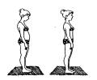

**Ida P. Rolfs Metode i strukturel integration** er en kropsbehandling, hvis formål er at rette kropsholdningen. Behandlingen foregår på samme måde som ved K.S.T. og terapeuten arbejder med lette tryk på bindevævet.

Der bliver givet en serie på 10 behandlinger, og tegningen af pigen giver  et billede af hvad strukturel integration er.

Strukturen er hvorledes de enkelte elementer af kroppen
indbyrdes er placeret (hovedet, nakken, skuldre, brystkassen,
bækkenet, benene og fødderne). Integration er den proces,
hvor man retter disse segmenter, så midtpunktet af et segment
bliver balanceret lige over midten af det næste.

Når en krop er i balance, hviler hovedet og nakken komfortabelt på skuldrene. Vægten fra skulder og brystkasse er centreret over hoftens tyngdecenter. Hele kropsvægten er fordelt godt på fødderne.

Rolf Metode giver en bedre holdning, således at man bruger mindre energi til at holde kroppen oppe når man står, sidder eller går, samtidig bliver åndedrættet lettere.

Rolf Metode forbedrer balancen i kroppen og bevægelserne bliver friere. Herved formindskes forkert belastning af udsatte steder i kroppen. Spændinger, smerte og stivhed formindskes/forsvinder.

Rolf Metode forbedrer platfod og hulfod.