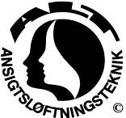

### A.L.T.© Andlitsmassaga.

(ANSIGTSLØFTNINGSTEKNIK)

A.L.T. © er ein løtt bindivevsmassaga, sum verður givin á húðina og tann
undirliggjandi bindevevnaðin. Húðin verður meira elastisk og fær eina
sunnari útstráling. Prosessin heldur fram í dýpdini og vil fevna um allar
97 vøddarnar í andlitinum, hárbotninum, hálsinum, nakkanum og í tí ovasta
partinum av herðunum.

Um vit hyggja gjølla, hava øll menniskju eitt asymmetriskt andlit. Men
hvussu týðilig er henda asymmetri? Øll menniskju spenna nakrar vøddar
meira í aðari síðuni og aðrar vøddar í hinari síðuni. Tess meira
spenningar, ið eru í andlitsvøddunum, tess meira asymmetriskt verður
andlitið. Við at minka spenningsstøði í øllum andlitsvøddunum koma tær
báðar síðurnar at líkjast hvør aðrari meira.

A.L.T. © kann hjálpa móti spenningum í andlits- og/ella nakkavøddunum,
ymiskari høvuðpínu og bøtir um munnbitið.

A.L.T. © viðgerðir geva størri vælveru í øllum kroppinum. Andlitið er
sálarinnar spegil. Kroppurin, tankar og kenslur hanga saman.

Tá sálarfrøðingar royna at finna út av, hvat flest fólk halda verða eitt
vakurt andlit, er tað ofta: eitt andlit, ið er avslappað, symmetriskt og
livandi – t.e. andlitið gevur aftursvar tá vit tosa við persónin.

Ein kombinatión av teim ymisku viðgerðum hevur víst góð úrslit við
trupulleikum sum miðoyrnabruna, kokuloysn og koyrilsbrestið (piskesmæld).
