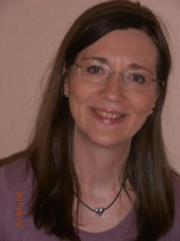

### Útbúgving:

- Skrivstovuútbúgving frá Fútaskrivstovuni í Tórshavn, 1970.
- Útbúgving sum sjúkrarøktarfrøðingur frá Sjúkrarøktarfrøðiskúla Føroya, 1989.
- Kraniosakral terapeut (KST) í 1992.
- Rolfs Metoda© í kropsterapi í 1995.
- ALT© andlitsmassaga í 1995.
- Góðkendur undirvísari i kraniosakral terapi í 1997.
- Sálarfrøðiligt embætisprógv cand. psych. frá Københavns Universiteti í 2010.
- Tankafelt terapeut (TFT) í 2010.
- Grundútbúgving í Kliniskari Hypnoterapi í 2011.
- Autorisatión frá Dansk Psykolognævn í 2012.

### Starvsroyndir:

Havi starvast innan skrivstovuyrki frá 1970 og í Heimarøktini í Miðvági og
Sandavági frá 1982. Starvast sum sjúkrarøktarfrøðingur á
Landssjúkrahúsinum, Ellis- og Avlamisheiminum í Vágum og sum
heimasjúkrarøktarfrøðingur í Vágum frá 1989-95. Undirvíst í kraniosakral
terapi og kropsterapium frá 1997 og undirvíst í sálarfrøði á Føroya
Studentaskúla 2002-03. Havi havt egnu viðgerðarstovu síðani 1992 og
starvast sum sjálvstøðugur sálarfrøðingur í Tórshavn og Miðvági frá 2010.

### Núverandi arbeiðsøki:

Sálarlig viðgerð av børnum, ungum og vaksnum, pør og familjur.
Sorgsamrøður i samband við sjúku og deyða og eisini vegleiðing og
ráðgeving um reaktiónir í samband við sorg hjá børnum og ungum.
Stressviðgerð og stressfyribyrging og viðgerð fyri tunglyndi, ótta og
fobium. Vegleiðing, undirvísing og supervisión av starvsfólki í heilsu-,
almanna- og skúlaverkinum. Havi møguleika at taka sálarfrøðiligar testir
av børnum og vaksnum t.d. WAIS-IV, WISC-IV, Rorschach, TAT, BDI v.m. fyri
betri at kunna síggja hvar og hvussu skal setast inn. Virki undir sáttmála
millum Heilsutrygd og felagið Føroyskir Sálarfrøðingar um fíggjarligt
ískoyti til sálarviðgerð. Viðgerð fyri pínu, ið t.d. kann stava frá
spentum vøddum, liðum, skeivleikum í beinagrindini og høvdinum v.m.
Viðgerð fyri lesitrupulleikar.

### Viðgerðartilgongdir

Í teimum sálarfrøðiligum viðgerðum arbeiði eg útfrá ymiskum
sálarfrøðiligum tilgongdum, sum verða tilpassaðar til tann einstaka.
Oftast arbeiði eg út frá eini eklektiskari hugsan, sum inniheldur ymiskar
teroretiskar hugsanir sum t.d. psykodynamiska teori,
kognitiva-atferðarteori, eksistentialistisk psykoterapi v.m. Eg samanbindi
tær ymisku sálarfrøðiligu tilgongdir við míni sjúkrarøktarfrøðiligu vitan
umframt mína vitan inna eystlendska tilgongd um kroppin, ið inniheldur
energibanar og akupunkturpunktir.

### Serlig áhugamál:

Samanheingi millum tað kropsliga og tað sálarliga, har eg viðgeri eftir
tørvinum hjá tí einstaka.
